# The Path To Production

## Legend

- Shipped (green)
  - complete enough to unblock next steps
- Milestones (Diamond Shape, yellow until shipped)
  - widening access to the platform
- Track (purple)
  - major categories of effort
- Blocked (red)
  - blocked by bug or inactivity.
- Validated (blue)
  - R&D code runs enough to prove the concept.
- Promising (teal)
  - Research indicates viability.
- Speculative (periwinkle)
  - anticipated, but not well understood, subject to change.

## Shipped

Stable enough to build upon.

### Gather Founders

We've found each other. We see the same problems, and we know that these problems merit solutions.

## Milestones

### Developer Network

A testbed for project contributors

### Alpha Network

Dedicated early adopters

### Beta Network

Forgiving early adopters

### Production Network

General use

## Tracks

Major fronts of effort.

### Design

Figuring out the long term system.

### Deploy

From IDE to runtime

### Prototype

Infrastructure scaffolding and demonstration

### Access

Client usability

## Blocked

We've run into problems here. We need to either solve the problem or re-evaluate the downstream goals.

### Ecosystem Review (Design)

We've had several ephemeral suggestions, and a couple formal ones. We need more formal input before we can claim a deep enough understanding of prior art to make intelligent design decisions.

Several projects have come through side-band that need to be investigated and funneled through suggestions.samizdapp.com:

- lens protocol (lens.dev)
- Cabal (cabal.chat)
- hubzilla (hubzilla.org)
- matrix (matrix.org)
- ActivityPub (https://en.wikipedia.org/wiki/ActivityPub)
- Holochain (holochain.org)
- 1749 (1749.com)
- Polis (https://www.globenewswire.com/news-release/2021/11/15/2334568/0/en/Polis-Enters-the-DeFi-Space-Launching-Smartchain-DEX-and-BSC-Bridge.html)
- PeerTube (joinpeertube.org)
- IPFS
- Ethereum Name Service
- LBRY
- SteemIt
- Pleroma

### Docker (Deploy)

Need devs to reliably be able to get started.

## Validated

These goals have been proven possible by running R&D code. They are still in need of engineering, but the "happy path" has been confirmed as valid.

### Web Server (Deploy/Prototype)

Caddy

### Peer VPN + DNS (Prototype)

Wesher + /etc/hosts

### Self Signed CA (Prototype)

Caddy trust and client CA install.

### Roaming VPN (Access)

Wireguard dual NIC, UPNP

### Split Horizon DNS (Access)

Pihole + custom dnsmasq

### LAN Discovery (Access)

MDNS

### Raspberry Pi 4 (Deploy)

Reference Implementation

### Rock Pi 4 (Deploy)

Available Hardware during chip shortage

### Demo App(s) (Prototype, Deploy)

Needs to do something

#### Pleroma

Twitter

#### Peertube

Youtube

#### Matrix

Discord

### Manual Client Setup

Followable instructions to download and configure Wireguard, trust a device CA certificate, and access device services via a standard browser

## Promising

These goals have been vetted by auditing documentation and/or source code to the point where we believe the goal is attainable in principle.

### Virtual Machine (Deploy)

virtualbox and vagrant

### Client App (Access)

react native, wireguard plugin, custom TLS handling webview

### Hardware Node (Access)

dropship supplier that will assemble kits and instructions.

## Speculative

anticipated but uninvestigated

### Service Selection (Design)

review survey selections, decide on best fit.

### Client API (Access)

unify client access steps under API endpoints

### Access Control (Design)

Identity, authentication, authorization flows.

### Connection Network(s) (Design)

point to point communication schema

### Content Networks(s) (Design)

decouple protocol daemons from frontend. ActivityPub, Matrix, BitTorrent, IPFS, Blockchain, Scuttlebut, NDN

### IMG Release Process (Deploy)

Build steps for all supported platforms

### Admin API (Design)

Generate/revoke admin/peer/client credentials, manage privilege/ban lists, pin/ignore content.

### Index (Design)

aggregate content networks into searchable metadata index.

### Search and Subscribe API (Design)

Access both the index and content itself via a unified API

### Publish API (Design)

Publish to content networks and index (if appropriate)

### CI/CD System (Deploy, Access)

Automate testing and deployment of node images and client app.

### Service Updates (Design)

Source core service updates from the platform itself

### Application Ecosystem (Design)

distribute, index, and install PWA style frontend interfaces which leverage the search, subscribe, and publish APIs

### Software Node (Deploy, Access)

Cross platform automation of VM image installation. Encapsulating VM daemon, image, and setup into a single wizard.
