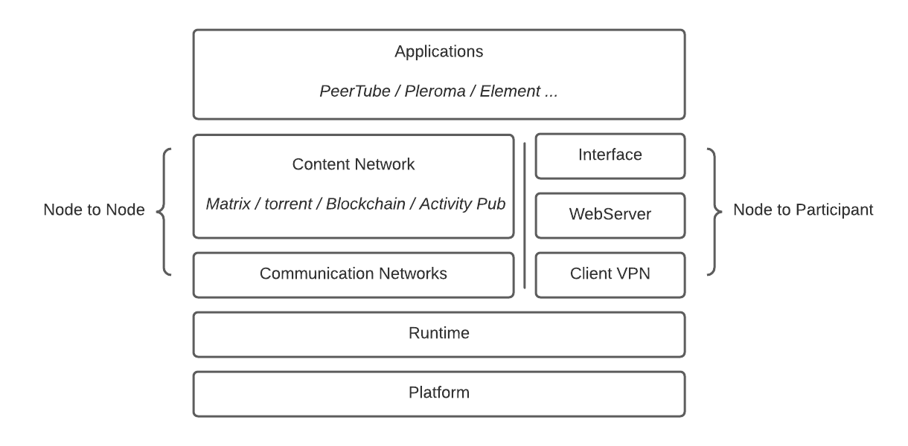
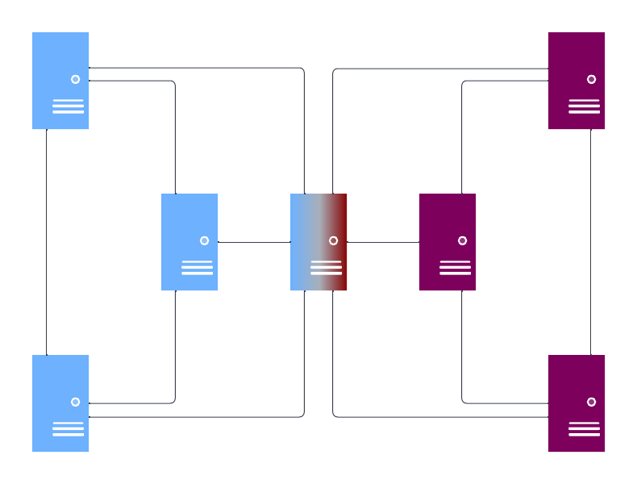
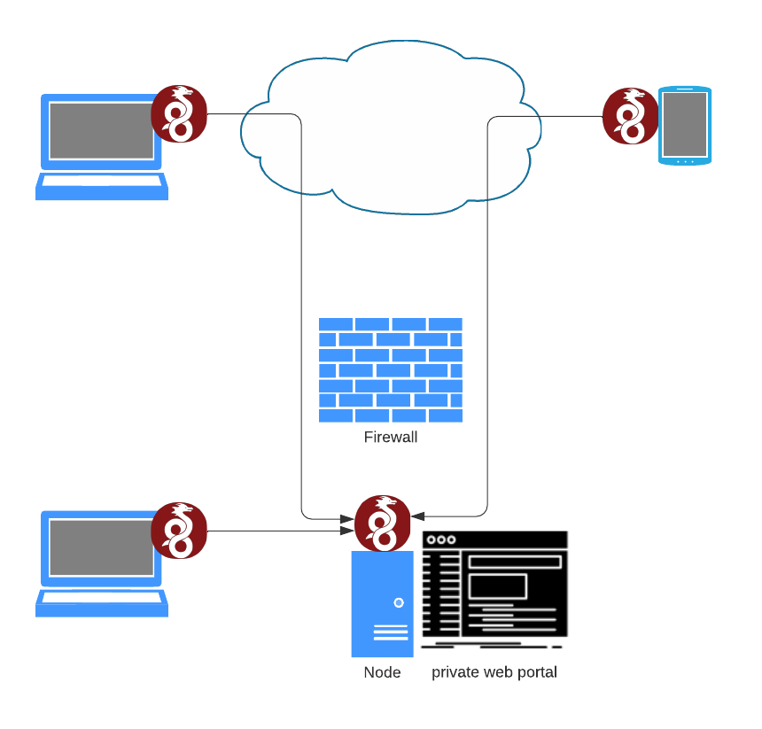

The SamizdApp Project has been conducting research and development on technologies relevant to the platform we envision. While there remains some uncertainty about some problems, we have reached the point that we believe our prototype architecture is compelling as a minimum viable platform. We present it here in the spirit of an RFC, or request for comments.

# Preamble

In the SamizdApp Manifesto, we outlined nine design priorities for the construction of a network worthy of the title of a digital public square. To briefly reiterate:

- Utility: Real use-cases that provide value
- Usability: Simple enough that you don’t need to be a developer to use.
- Urgency: Compose existing technologies to get this into the world quickly
- Decentralization: Distribute infrastructure beyond single points of control or failure
- Sovereignty: Participants must control content they consume and distribute
- Extensibility: The platform should nurture a broad ecosystem of applications
- Evolvability: All code and protocols should be open source, and modifiable.
- Practicality: Platform development must be economically sustainable.

A keen reader will immediately note that several of the priorities above are in tension. For example, a centralized website is the pinnacle of ease of use, but it betrays decentralization entirely. Managing these trade-offs across many competing priorities is a constant source of complexity. As such, there will be times when we will have to pick a poison, so to speak. Where we do so, we will be explicit about our reasoning and be thorough in considering strategies to improve sub-optimal compromises.

With these caveats in mind, we can use the priorities above as a guide to give an overview of our draft architecture.

## Utility

_This means delivering real use cases from day one._

Publishers and Participants
Imagine a popular podcaster at risk of being censored and cut-off from their audience. This individual needs their work to be broadly accessible at scale. They have a passionate core community of listeners, and sometimes go viral within their spheres of influence. Self-hosting all of their media is cost prohibitive and unscalable.

Our approach to solving this problem is to create a means by which a community can contribute storage and bandwidth to reliably serve a creator’s content worldwide, in exchange for access to private digital spaces.

By way of analogy: Imagine a large, free public concert that is paid for by selling backstage passes. Only the people who buy tickets get the VIP experience, but by doing so they allow everyone to enjoy the music. In this model, running a node in the network and rebroadcasting a creator’s content is the equivalent of buying a backstage pass.

## Usability

_This means using well familiar patterns of interaction, with minimal setup obstacles._

### Browser First

The most common and well understood way to access services on the internet is by way of a web browser. By focusing on the browser as the point of interaction between a participant and the network, we can ensure a familiar experience on any device.

## Urgency

This means re-using and composing the technologies already at our disposal to move quickly.

In the quest for a minimum viable platform, we have identified three open source technologies that will enable us to provide utility and usability at a fast pace, while we continue the work of generalizing the platform.

### Balena Suite

Balena1 is a service for managing fleets of linux devices, abstracting away the pain of orchestrating software deployment and rolling out updates. While they offer a centralized SaaS product, the majority of the stack is open source, including an implementation of the control server.

While we are in this alpha stage of development, we will leverage Balena to bootstrap our early test and development network.

This of course is in tension with our priority of decentralization, so before we can consider the platform as having reached “version 1”, we must create a solution that bridges the Balena device operating system into a decentralized ecosystem for software updates. This is discussed further in the section on evolvability.

### PeerTube

PeerTube2 is an open-source federated video and live-streaming platform that leverages ActivityPub and BitTorrent. It provides a robust system to subscribe and automatically re-host content from those you subscribe to, as well as a youtube style interface. We have chosen it to cover the “Publisher” use case above.

### Pleroma

Pleroma3 is an open-source federated micro-blogging platform that runs over ActivityPub. Similar to Mastodon, but focused on running on lower power devices like the raspberry pi. It features a default interface similar to Mastodon or Twitter. We have chosen Pleroma to cover the “Participant” use case above.

## Decentralization

This means distributing the hardware infrastructure of the platform among participants.

To achieve decentralization, we put the infrastructure back into the hands of the participants. Only by owning your own node in the network can you truly be a first class citizen of a decentralized system. While some may elect to provide public access nodes, those nodes will always represent a potential point of third party control.

To achieve a means of decentralized communication that can flow throughout a global network, we separate our concerns into the management of connections and the distribution of content.

## Connection Networks

Connection Networks are small to medium sized VPNs that allow any two nodes within them to communicate directly with no intermediary. Each node creates a connection network that they may invite peers to join, and may likewise join any number of other connection networks.

By way of metaphor: Your connection network is made up of all your friends that you introduce to each other. In turn, each connection network you join is an introduction to the friends of your friend. So, connections do not enable you to talk with the entire world directly, but they enable you to talk to all your friends and your friends' friends, and allow your friends to talk to each other.

To achieve global distribution of content, we make use of various content networks.

## Content Networks

Content Networks are our category for any protocol that distributes data. They may utilize a wide range of underlying protocol types (gossip, dht, etc), but let us consider ActivityPub as an example:

ActivityPub allows nodes to subscribe to updates and data from any node that it has the ability to communicate with directly. In our case, that means that a node can use ActivityPub to subscribe to any node in any of its communication networks. Those nodes in turn can subscribe to nodes in their communication networks, and so on. In this way, the network of ActivityPub subscriptions can flow through the global network.

More concretely, consider a tweet micro-blog post going viral. Initially, it is only viewable by followers who share a connection network with the author. With each retweet re-post, it can be relayed to a new cluster of connection networks, and may propagate widely.

ActivityPub and Bittorrent are the content networks utilized by our initial selections of PeerTube and Pleroma.

## Sovereignty

This means keeping all associations voluntary, and all content whole, and hosting opt-in.

Sovereignty in association is achieved by allowing nodes to control access to their own communication network, and to block communication on a case by case basis to specific nodes.

Sovereignty in content is achieved through the judicious selection of content network protocols. The first two, ActivityPub and Bittorrent, satisfy our conditions handily.

Examples of protocols that would violate sovereignty are TOR (for routing unknown traffic with unknown association) and freenet (for hosting slices of opaque content automatically).

## Scalability

This means making efficient use of bandwidth and storage to disseminate popular content widely.

Efficient use of bandwidth and storage is achieved in our system by aggressive use of subscriptions and proactive fetching and caching. Most platforms today deliver content on-demand. In our case, the existence of our network of always-on nodes means that when new content is available, we can begin downloading it immediately so that it’s ready for participants to interact with when they’re ready. Of course, this behavior will be configurable.

## Extensibility

This means having a service architecture that allows new applications to be developed, installed, and shared.

Both Pleroma and PeerTube are complete solutions in their domains, with batteries included. Indeed, this is one of the reasons why they are attractive packages to bundle together to satisfy our priority of urgency. However, our ultimate goal is to decouple content networks from the interfaces that use them.

In this way, the work of the platform developers can be focused on providing a set of robust content networks, while exposing an API allowing for an ecosystem of front-end applications to be built for a wide diversity of use-cases.

## Evolvability

This means keeping all protocols and code open-source, and allowing all participants to use the implementations of their choice.

Keeping all protocols and code open-source is easy enough, but allowing participants to use the implementations of their choice is tougher. For the sake of urgency, we are using the Balena suite of tools to enable rapid prototyping and development in this early phase, which means that each node has a single source of truth for the code it runs.

Our path to evolvability begins by providing a mechanism by which nodes may choose another Balena controller to receive code updates from. This is a step in the right direction, but still represents far too much concentration of power for a robust system.

Our ultimate objective is to create a bridge between the Balena client and one or more of the content networks on the platform itself. In this way, the bridge can collect platform updates from one or more developers in the network, merge them, and deploy the updates to itself.

## Practicality

This means providing a business model that is both achievable in the short term and sustainable in the long term.

In the SamizdApp Manifesto, we outlined the two primary business models of the web: ad-support and subscription. To our thinking, both of these business models are antithetical to our priorities.

The early phases of ambitious endeavors are usually undertaken by those who recognize the importance of the project, and we are no exception. While this is enough in the beginning, we must transition quickly from contribution out of good will to contribution out of good sense.

In the long term, we seek an economic model whereby every contributor in the value chain is rewarded for their work. Payment for content should be dynamically allocated between the publisher that created it, the designer of the interface, the hosts of the content, the developers of the code, etc.

# Draft Architecture

The sections above gave a tour of our solution from the point of view of the priorities we hold. Now we turn to the point of view of the technology itself, to give a perspective on how all these pieces fit together. This is the story of nodes and the people that run them.

## Nodes

A node is a server running a suite of services to enable it to communicate with other nodes, exchange data, and provide a web interface to its owner. A node is composed of a series of logical layers:

### Platform

The platform layer is the physical or virtual environment that provides it’s processing power, storage, and network access. A node platform could be a Raspberry Pi, a repurposed PC, or a virtual machine.

Our reference implementation targets a Raspberry Pi, or similar single board computer.

### Runtime

The runtime layer controls the set of services that run on a node. It provides an abstract means of updating a node software while maintaining its data.

Our reference implementation uses BalenaOS and BalenaEngine to orchestrate services on nodes.

### Communication Networks

Communication networks have been discussed above. In brief, they are small, fully connected VPNs. Nodes each control one communication network of their own, and may join several by invitation.

The diagram below illustrates two communication networks that share a member. While nodes from different communication networks cannot connect to each other directly, data may flow between them via various content networks.

Our reference implementation uses Wireguard to construct communication networks.

### Content Networks

Content Networks relay data based on voluntary re-hosting. In the diagram above, content published from one of the nodes on the blue communication network becomes accessible to the red communication network by way of being relayed through the content networks center node.

Our reference implementation uses ActivityPub and Bittorrent as our first generation of content networks.

### Client VPN

The client VPN limits access to a node to explicitly authorized devices, like a node owner’s phone, laptop, etc. It also provides a DNS service to resolve human meaningful local domains to the node, without interfering with regular internet access.

Our reference implementation uses Wireguard as the VPN service, configured to listen both over the local network and the broader internet, so that clients may seamlessly interact with their node both at home and away.

### Web Server

The web server serves interfaces to node owners over the client VPN. This enables them to interact with the network through the familiar pattern of a web app.

Our reference implementation uses Caddy as our web server.

### Interface

The interface layer exists in anticipation of our goal of evolvability. As mentioned before, our immediate prototype uses the included interfaces of Pleroma and Peertube. In the future, however, the interface layer will be abstracted away from tight coupling with a singular backend.

### Application

The application layer is the recombination of an interface interacting with one or more content networks via an abstract API. Once again, in our prototype implementation, the interfaces and their back-ends are tightly coupled, but work is progressing on how we may abstract them.

# People

A person who wishes to publish and participate in the platform must do so via a node running the stack of services defined above. Broadly speaking, there are three steps to complete.

## Create

First, one must create a node, either by purchasing a pre-configured device, installing the software stack on their computer, or hosting the software in a virtual machine.

## Access

Next, one must access their node via the wireguard client VPN. This involves installing a wireguard client app, and configuring it via QR code or config file.

## Trust

Finally, one must declare their trust in the device by installing a self-signed tls certificate, such that their browser consents to loading the interfaces provided by the web server.

# The Elephant(s) in the Architecture

As promised at the top of this post, there are problems not addressed by this draft.

Decentralized DNS, IP assignment, NAT traversal, and TLS certificate exchange are each in need of an architecture of their own. We have some ideas, and we’ll be documenting them in the coming weeks, but we want to hear yours as well.

For a project with “dApp” in its name, you might be surprised to have not seen a single mention of blockchains. Indeed, blockchain tech promises solutions to many challenges we identify above. We have researched several, but the web3 ecosystem is beyond what one team can grok. We need to learn about the projects we haven’t seen.

This document is a request for comments, but in the very spirit of the public square we wish to create, it is also a request for proposals and a request for audit. Do you know of a better stack that’s further along? Do you have ideas for a more elegant composition of technologies? Is something about our plan broken?

We suspect that the answer to all of these questions is yes, which is why we’re committed to showing our work early and often, to maximize the quality of our end result.
